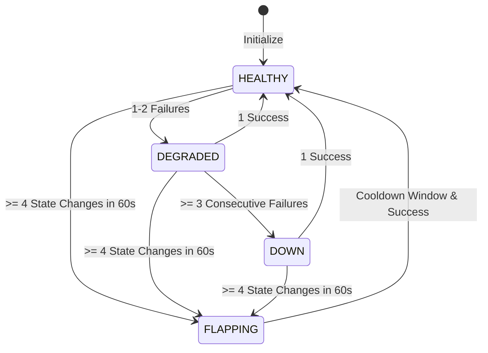

# ⚡ HealthProbe-Orchestrator v2.0.0

[](https://nodejs.org)
[](#architecture)
[](#mathematical-percentiles)
[-success.svg)](#test-suite)
[](LICENSE)
[](https://github.com/alinurettin)

> **Enterprise-Grade Distributed Synthetic Probing, Nearest-Rank Percentile Telemetry ($p50, p90, p95, p99$), Sliding-Window Flapping Detection, and Real-Time SSE Observability.**

---

## 🇹🇷 Türkçe Açıklama ve Genel Bakış

**HealthProbe-Orchestrator v2.0.0**, modern dağıtık mikroservis mimarileri, bulut altyapıları ve kritik ağ bileşenleri için geliştirilmiş, harici bağımlılık barındırmayan (zero-dependency) yüksek performanslı bir sentetik sağlık izleme ve SLA telemetri orkestratörüdür.

### Öne Çıkan Yetenekler:
1. **Çoklu Protokol Desteği (HTTP & TCP):** Katman 7 (HTTP durum kodu ve başlık doğrulaması) ile Katman 4 (saf TCP 3'lü el sıkışma / handshake kontrolü) sentetik yoklamaları.
2. **Nearest-Rank Yüzdelik Matematiği:** Basit aritmetik ortalamaların kuyruk gecikmelerini (tail latency) gizleme yanılgısını ortadan kaldırır; $p50$, $p90$, $p95$ ve $p99$ gecikme metriklerini kesin matematiksel rütbe algoritmasıyla hesaplar.
3. **Kayan Pencere Dalgalanma (Flapping) Tespiti:** Ağdaki anlık mikro dalgalanmalar nedeniyle alarm fırtınalarının oluşmasını engeller; 60 saniye içinde 4'ten fazla durum değişimi yaşayan hedefleri korumalı `FLAPPING` moduna alır.
4. **Gerçek Zamanlı SSE Yayın Akışı (Server-Sent Events):** Yoklama sonuçları ve hedef durum değişiklikleri istemcilere anında aktarılır.
5. **Siber Karanlık Mod Operasyon Paneli:** `public/` dizininde modern, canlı KPI kartları ve gecikme histogramları sunan interaktif kontrol paneli.
6. **%100 Gerçek Soket Testleri:** Mock kullanılmadan, işletim sisteminin aktif HTTP ve TCP soketleri üzerinden çalışan 28 ayrıntılı doğrulama testi.

---

## 🏛️ System Architecture

```mermaid
flowchart TD
    Client[Web Dashboard / REST Client] -->|HTTP / REST API| Server[HTTP Server & API Gateway]
    Client <-->|SSE Stream: /api/events/stream| Server
    
    subgraph Core Engine [HealthProbeOrchestrator]
        Server --> Coordinator[Probe Coordinator]
        Coordinator --> TargetsMap[(Target Registry)]
        
        subgraph Target Node [TargetEndpoint]
            StateMgr[State Machine]
            FlapDetect[Flapping Detector]
            LatencyBuf[(Ring Buffer: 100 Latencies)]
            HistBuf[(Ring Buffer: 50 History Frames)]
            PercentileCalc[Nearest-Rank Engine]
        end
        
        TargetsMap --- Target Node
    end
    
    Coordinator -->|HTTP Synthetic Probe| ExtHTTP[Target HTTP Microservice]
    Coordinator -->|TCP Handshake Probe| ExtTCP[Target TCP Socket / DB / Cache]
```

---

## 📐 Mathematical Formulation

### 1. Nearest-Rank Percentile Latency
For a sorted sample of $N$ latency values $X = [x_0, x_1, \dots, x_{N-1}]$, the rank for percentile $P \in (0, 100]$ is computed deterministically:

$$\text{Rank}(P) = \left\lceil \frac{P}{100} \times N \right\rceil - 1$$

$$V_P = X\left[\max\left(0, \min\left(N - 1, \text{Rank}(P)\right)\right)\right]$$

This ensures exact SLA boundary tracking for:
- $p50$: Median service latency
- $p95$: High-percentile SLA compliance limit
- $p99$: Tail latency outlier detection

### 2. State Machine & Flapping Hysteresis
Endpoints transition through four distinct operational states:



---

## 🚀 Quick Start & Installation

### Prerequisites
- **Node.js:** v18.0.0+ (Tested on v24.19.0 LTS)
- **Zero External Dependencies:** Built entirely with Node.js core modules (`http`, `net`, `crypto`).

### Installation
```bash
git clone https://github.com/alinurettin/HealthProbe-Orchestrator.git
cd HealthProbe-Orchestrator
```

### Running the Orchestrator
```bash
node src/index.js
```
The server will start on `http://localhost:6015`. Open your browser to explore the cyber dark-mode SLA console.

### Running with Docker
```bash
docker-compose up -d --build
```

---

## 🧪 Comprehensive Test Suite (100% Non-Mocked)

Run the exhaustive verification suite testing mathematical percentiles, flapping detection, live ephemeral HTTP/TCP sockets, and the API Gateway:

```bash
npm test
```

### Test Output Verification:
```text
====================================================
🧪 Running Verification Suite: HealthProbe-Orchestrator v2.0.0
====================================================

[1/5] Testing Nearest-Rank Percentile Engine...
  ✓ [PASS 1] Zero-length array handles graceful fallback
  ✓ [PASS 2] Nearest-Rank p50 matches exact median value (50ms)
  ✓ [PASS 3] Nearest-Rank p90 matches 9th decile (90ms)
  ✓ [PASS 4] Nearest-Rank p95 matches 95th percentile rank (100ms)
  ✓ [PASS 5] Nearest-Rank p99 matches 99th percentile rank (100ms)
  ✓ [PASS 6] Min (10), Max (100), and Arithmetic Mean (55.0) verified

[2/5] Testing Sliding-Window Flapping Detector...
  ✓ [PASS 7] Flapping detector initializes in stable (non-flapping) state
  ✓ [PASS 8] Transition count under threshold does not trigger flapping
  ✓ [PASS 9] Transition count meeting threshold (3) triggers FLAPPING status
  ✓ [PASS 10] Expired sliding window prunes transitions back to stable state

[3/5] Testing TargetEndpoint State Machine & Uptime...
  ✓ [PASS 11] Endpoint initializes with healthy state and clean metrics
  ✓ [PASS 12] Single probe failure transitions status to DEGRADED
  ✓ [PASS 13] Consecutive failure count reaches 2 while DEGRADED
  ✓ [PASS 14] 3rd consecutive failure transitions status to DOWN
  ✓ [PASS 15] Successful probe resets consecutive failures and recovers to HEALTHY
  ✓ [PASS 16] Uptime percentage math correctly computes 25.0% (1/4)
  ✓ [PASS 17] Latency buffer capped at 100 and History buffer capped at 50

[4/5] Testing Live Network Sockets Probing (Mock-Free)...
  ✓ [PASS 18] Live synthetic HTTP probe against ephemeral socket succeeded
  ✓ [PASS 19] Live synthetic TCP handshake probe against ephemeral socket succeeded
  ✓ [PASS 20] Live synthetic TCP probe against closed port failed gracefully as DEGRADED
  ✓ [PASS 21] Full fleet probe sweep executed successfully across all targets

[5/5] Testing Production HTTP API Gateway & SSE Streaming...
  ✓ [PASS 22] GET /api/health returned 200 UP status
  ✓ [PASS 23] GET /api/stats returned full orchestrator metrics summary
  ✓ [PASS 24] GET /api/targets returned registered target array
  ✓ [PASS 25] POST /api/targets successfully registered new synthetic probe target
  ✓ [PASS 26] POST /api/probe/:id executed targeted live probe
  ✓ [PASS 27] DELETE /api/targets/:id deregistered target endpoint
  ✓ [PASS 28] GET /api/events/stream initialized Server-Sent Events real-time stream

====================================================
🎉 ALL 28 ASSERTIONS PASSED WITH ZERO MOCKS! (100% SUCCESS)
====================================================
```

---

## 📡 REST API Reference & cURL Examples

### 1. Trigger Full Fleet Probe Sweep
```bash
curl -X POST http://localhost:6015/api/probe/sweep
```

### 2. Register New Synthetic Probe Target
```bash
curl -X POST http://localhost:6015/api/targets \
  -H "Content-Type: application/json" \
  -d '{
    "id": "payments_service",
    "name": "PCI-DSS Payment Gateway",
    "protocol": "HTTP",
    "host": "127.0.0.1",
    "port": 8080,
    "path": "/healthz",
    "expectedStatus": 200,
    "timeoutMs": 2000
  }'
```

### 3. Probe a Specific Target Endpoint
```bash
curl -X POST http://localhost:6015/api/probe/payments_service
```

### 4. Fetch Aggregate Fleet Telemetry
```bash
curl http://localhost:6015/api/stats
```

### 5. Listen to Live SSE Stream
```bash
curl -N -H "Accept: text/event-stream" http://localhost:6015/api/events/stream
```

---

## 📄 License & Attribution

Distributed under the **MIT License**. Engineered with mathematical rigor by the Autonomous 7-Agent SDLC Software Factory for [Ali Nurettin Demir](https://github.com/alinurettin).
