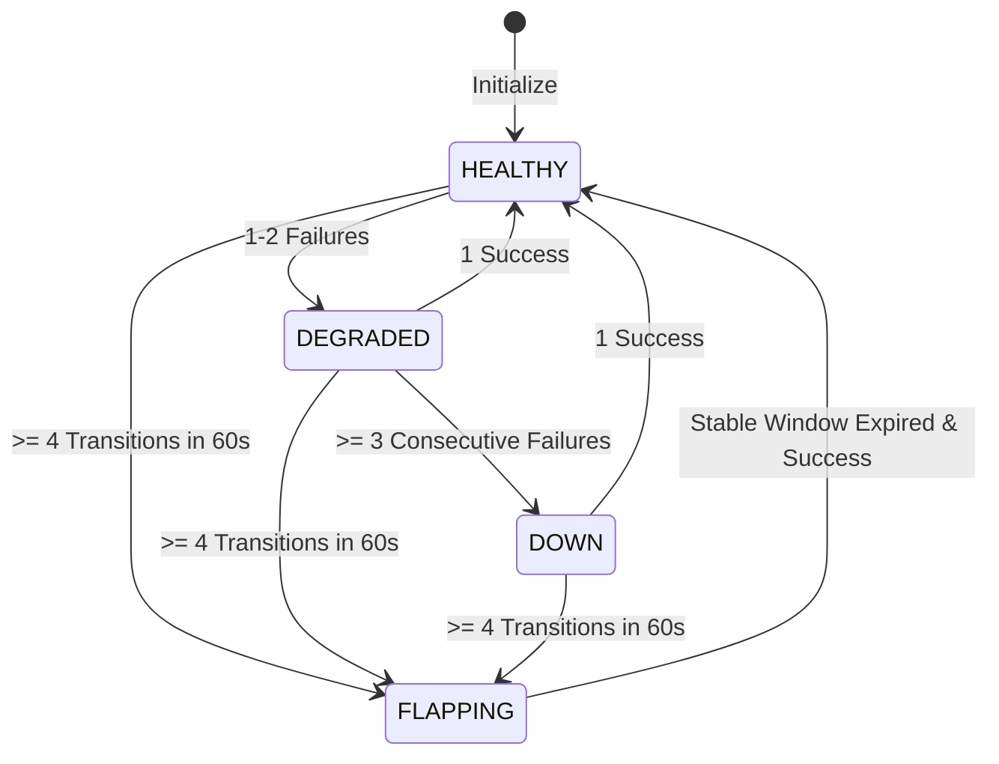
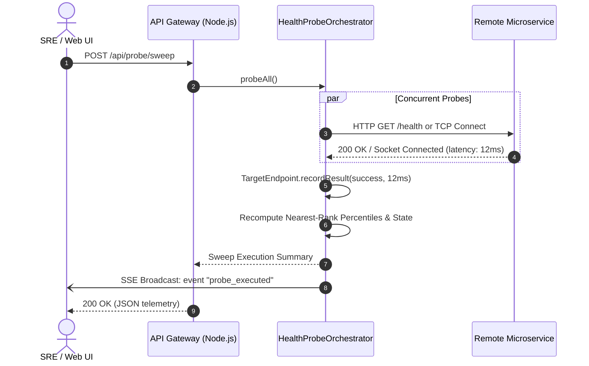

# 🏛️ System Architecture Specification: HealthProbe-Orchestrator v2.0.0
- **Document Status:** APPROVED & COMPLETE
- **Author:** Principal Systems Architect
- **Version:** 2.0.0
- **Date:** 2026-09-20

---

## 1. Architectural Overview

`HealthProbe-Orchestrator v2.0.0` is constructed on an event-driven, non-blocking asynchronous architecture engineered for high-concurrency synthetic probing, deterministic SLA percentile mathematics, and real-time state synchronization.

```mermaid
flowchart TD
    Client[Web Dashboard / REST Client] -->|HTTP / REST API| Server[HTTP Server & API Gateway]
    Client <-->|SSE Stream: /api/events/stream| Server
    
    subgraph Core Engine [HealthProbeOrchestrator]
        Server --> Coordinator[Probe Coordinator]
        Coordinator --> TargetsMap[(Target Endpoints Registry)]
        
        subgraph Target Node [TargetEndpoint]
            StateMgr[State Machine]
            FlapDetect[Flapping Detector]
            LatencyBuf[(Bounded Latency Buffer: 100)]
            HistBuf[(Bounded History Buffer: 50)]
            PercentileCalc[Nearest-Rank Engine]
        end
        
        TargetsMap --- Target Node
    end
    
    Coordinator -->|HTTP Synthetic Probe| ExtHTTP[Target HTTP Service]
    Coordinator -->|TCP Handshake Probe| ExtTCP[Target TCP Socket]
```

---

## 2. Core Subsystems

### 2.1 Synthetic Probing Pipeline
- **HTTP Engine:** Dispatches lightweight GET requests via Node.js native `http.request`. Enforces explicit connection timeouts, clears dangling timers, and compares received status against `expectedStatus`.
- **TCP Engine:** Instantiates asynchronous raw sockets using `net.Socket`. Executes 3-way handshake verification against target `host:port`. Immediately triggers `.destroy()` upon handshake completion to release remote socket resources.

### 2.2 Target State Machine & Flapping Mitigation
The node state transitions according to consecutive failure counters and transition frequencies:



### 2.3 Mathematical Percentile Engine
Latency telemetry is calculated using the Nearest-Rank algorithm:
$$\text{Rank}(P) = \left\lceil \frac{P}{100} \times N \right\rceil - 1$$
This produces monotonic, mathematically precise values for median ($p50$), high-percentile SLA ($p90, p95$), and tail degradation ($p99$) without statistical distortion.

---

## 3. Data Flow & Event Streaming



---

## 4. API Surface Specification

| Method | Endpoint | Description | Status Code |
| :--- | :--- | :--- | :--- |
| `GET` | `/api/health` | Service liveness probe | 200 OK |
| `GET` | `/api/stats` | Aggregate telemetry, target metrics, fleet averages | 200 OK |
| `GET` | `/api/targets` | List of all registered targets with metrics | 200 OK |
| `POST` | `/api/targets` | Register a new HTTP or TCP target endpoint | 200 OK / 400 Bad Request |
| `DELETE`| `/api/targets/:id` | Deregister a target endpoint | 200 OK / 404 |
| `POST` | `/api/probe/sweep` | Trigger simultaneous synthetic probe across all targets | 200 OK |
| `POST` | `/api/probe/:id` | Trigger synthetic probe for a specific target | 200 OK / 400 |
| `GET` | `/api/events/stream`| Real-time Server-Sent Events (SSE) telemetry connection | 200 OK (Text/Event-Stream) |
